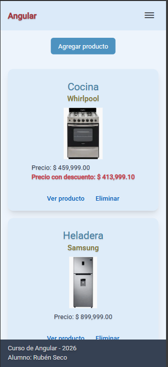
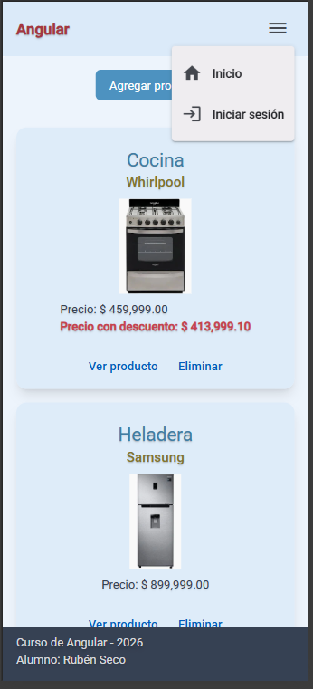
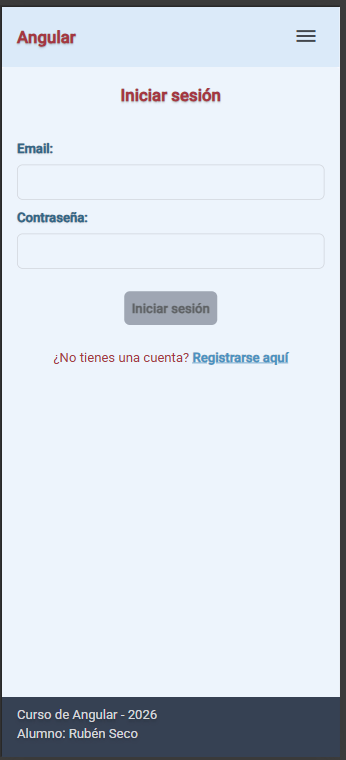
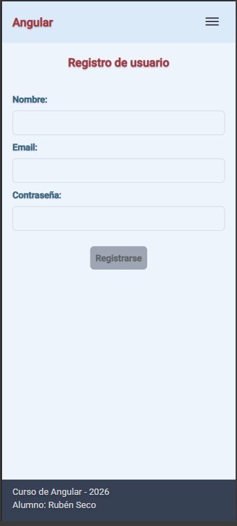
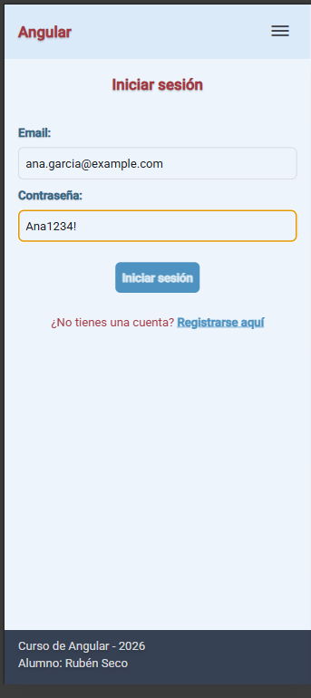
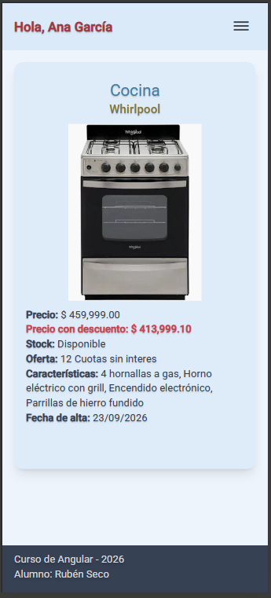

# Diplomatura en Profesional Full-Stack Developer

## Curso de desarrollo con Angular - Profesor: Gabriel Alberini

### Módulo 1: Angular

### Unidad 4: Angular Avanzado. Routing.

### Tarea 4: Aplicación modular con rutas y almacenamiento en navegador.

### Objetivos:

Aplicar los conceptos de **módulos**, _**routing**_, **rutas dinámicas**, **lazy loading** y el uso de **localStorage/sessionStorage** en Angular.

### Consideraciones:

- Se simula la utilización de datos dinámicos mediante señales, haciendo en primer lugar una carga de datos estáticos.
- Se mantiene la persistencia de los datos en el navegador mediante el uso de **localStorage**.
- Se configura un **lazy loading** de los módulos de la aplicación mediante el uso de **loadComponent**.
- Se almacena en el localStorage la última URL visitada por el usuario para redireccionar a ella luego de reinciar la aplicación.
- Se configura una **ruta dinámica** para la visualización de los detalles de un producto.

### Capturas de pantallas:

<table>
  <thead>
    <tr>
      <th>Inicio</th>
      <th>Menú</th>
      <th>Inicio de sesión</th>
    </tr>
  </thead>
  <tbody>
    <td>
      
    </td>
    <td>
      
    </td>
    <td>
      
    </td>
  </tr>
  </tbody>
</table>
<table>
  <thead>
    <tr>
      <th>Registro</th>
      <th>Inicio de sesión con datos</th>
      <th>Detalles del producto</th>
    </tr>
  </thead>
  <tbody>
    <td>
      
    </td>
    <td>
      
    </td>
    <td>
      
    </td>
  </tr>
  </tbody>
</table>

### Pasos para el despliegue en Firebase:

1. Crear un proyecto en Firebase:

```bash
npm install firebase
```

1. Instalar dependencias de Firebase para Angular:

```bash
ng add @angular/fire
```

1. Configurar variables de entorno:

```typescript
export const environment = {
  production: false,
  firebaseConfig: {
    apiKey: '',
    authDomain: '',
    projectId: '',
    storageBucket: '',
    messagingSenderId: '',
    appId: '',
    measurementId: '',
  },
};
```

1. Iniciar sesión en Firebase:

```bash
firebase login
```

1. Inicializar el proyecto en Firebase:

```bash
firebase init
```

1. Crear el build de producción:

```bash
ng build
```

1. Hacer el deploy de la aplicación:

```bash
firebase deploy
```

1. Verificar el despliegue en Firebase:

[https://angular-m1-t4.web.app](https://angular-m1-t4.web.app)

### Pasos para la ejecución local:

1. Clonar el repositorio:

```bash
git clone https://github.com/Diplomatura-Full-Stack-Developer/Angular-M1-T4
```

2. Instalar las dependencias:

```bash
npm install
```

3. Configurar variables de entorno:

```typescript
export const environment = {
  production: false,
  firebaseConfig: {
    apiKey: '',
    authDomain: '',
    projectId: '',
    storageBucket: '',
    messagingSenderId: '',
    appId: '',
    measurementId: '',
  },
};
```

4. Ejecutar la aplicación:

```bash
ng serve
```

### Recursos utilizados:

- Angular ([https://angular.dev/](https://angular.dev/))
- Angular CLI - Versión 22.1.7 ([https://angular.io/cli](https://angular.io/cli))
- Node.js - Versión 24.20.0 ([https://nodejs.org/es/download/](https://nodejs.org/es/download/))
- Tailwind CSS - Versión 4.1.12 ([https://tailwindcss.com/](https://tailwindcss.com/))
- Angular Material - Versión 22.1.5 ([https://material.angular.io/](https://material.angular.io/))

### Alumno: Rubén Seco

### Comisión: 181802
